# BÁO CÁO THỰC HÀNH LAB 2A: KIẾN TRÚC MICROSERVICES
## Môn học: Phát triển ứng dụng Web nâng cao

---

### 👨‍💻 THÔNG TIN SINH VIÊN
* **Họ và tên:** Phùng Anh Lực
* **Mã số sinh viên (MSSV):** N23DCPT033
* **Repository Backend:** [N23DCPT033_PhungAnhLuc_Web_Prac2A](https://github.com/phunganhluc3105-spec/N23DCPT033_PhungAnhLuc_Web_Prac2A)
* **Repository Frontend (Next.js 15):** [N23DCPT033_PhungAnhLuc_Web_Prac2A-FE](https://github.com/phunganhluc3105-spec/N23DCPT033_PhungAnhLuc_Web_Prac2A-FE)

---

### 🌐 HỆ THỐNG LIÊN KẾT TRỰC TUYẾN (LIVE PRODUCTION)
* **API Gateway (Public Endpoint):** [https://gateway-service-production-69d0.up.railway.app](https://gateway-service-production-69d0.up.railway.app)
* **Health Check Gateway:** [https://gateway-service-production-69d0.up.railway.app/health](https://gateway-service-production-69d0.up.railway.app/health)
* **API Danh sách sản phẩm (Public):** [https://gateway-service-production-69d0.up.railway.app/api/products](https://gateway-service-production-69d0.up.railway.app/api/products)
* **Cloud Database:**
  * **PostgreSQL:** Supabase Pooler (`aws-0-ap-southeast-1.pooler.supabase.com`)
  * **MongoDB:** MongoDB Atlas Replica Set Cluster
  * **Media Storage:** Cloudinary CDN
* **Postman Collection Test Suite:** [`postman/Lab2.postman_collection.json`](./postman/Lab2.postman_collection.json)

---

## 1. TỔNG QUAN KIẾN TRÚC HỆ THỐNG (SYSTEM ARCHITECTURE)

Hệ thống được xây dựng theo kiến trúc **Microservices phân tán**, toàn bộ giao tiếp ngoại vi đi qua một đầu mối duy nhất là **API Gateway**. Mạng nội bộ kết nối an toàn bằng **Railway Private Network** (`*.railway.internal`).

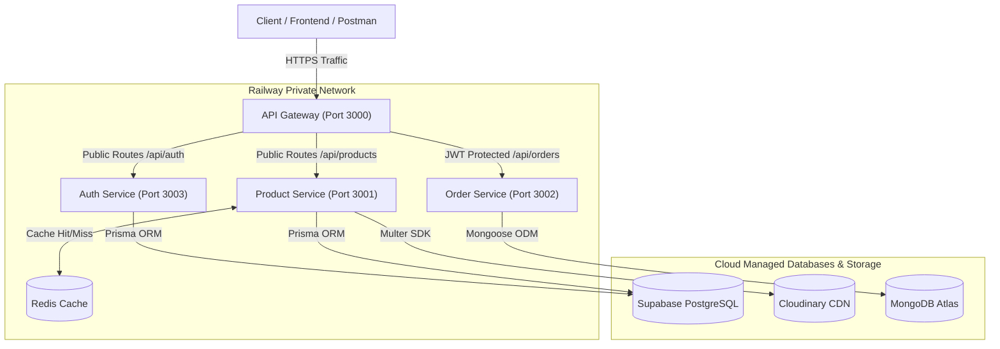

### Chi tiết các thành phần:
1. **API Gateway (`api-gateway`):**
   * Reverse Proxy định tuyến traffic đến các service con.
   * Rate Limiter: giới hạn 100 requests / 15 phút / IP.
   * CORS & Helmet HTTP Security Headers.
   * Middleware xác thực JWT tập trung: chặn `401 Unauthorized` đối với các route đơn hàng `/api/orders`.
2. **Product Service (`product-service`):**
   * Quản lý sản phẩm & danh mục bằng **PostgreSQL + Prisma ORM**.
   * Đầy đủ nghiệp vụ: CRUD, phân trang, lọc nâng cao, soft delete (xoá mềm).
   * **Redis Cache:** Lưu cache danh sách sản phẩm với TTL 5 phút, tự động xoá cache khi có thay đổi dữ liệu.
   * **Cloudinary Upload:** Hỗ trợ upload ảnh sản phẩm trực tiếp lên Cloudinary CDN (`POST /api/products/:id/image`).
   * Tài liệu Swagger UI tại `/api-docs`.
3. **Order Service (`order-service`):**
   * Quản lý đơn đặt hàng bằng **MongoDB + Mongoose ODM**.
   * Pre-save hook tự động tạo mã đơn hàng dạng `ORD-YYYYMMDD-XXXX`.
   * Virtual field `totalItems` tự động tính tổng số lượng món hàng.
   * Tài liệu Swagger UI tại `/api-docs` có tích hợp nút **Authorize (Bearer Token)**.
4. **Auth Service (`auth-service`):**
   * Đăng ký, Đăng nhập, Cấp phát cặp JWT Token: `accessToken` (15 phút) và `refreshToken` (7 ngày).
   * Mã hoá mật khẩu bằng `bcryptjs` (salt 10 vòng).
   * Endpoint `GET /api/auth/me` xem thông tin tài khoản đang đăng nhập.
5. **Frontend Web Storefront (`lab2a-frontend`):**
   * Xây dựng bằng **Next.js 15 (App Router) + Tailwind CSS + shadcn/ui**.
   * Kết nối trực tiếp API Gateway, hiển thị huy hiệu `⚡ Redis Cache`, hỗ trợ giỏ hàng, đặt hàng và upload ảnh Cloudinary trực tiếp.

---

## 2. BẢNG TỔNG HỢP TIÊU CHÍ ĐÁNH GIÁ (TỰ CHẤM 100/100)

| STT | Nhóm tiêu chí | Yêu cầu kỹ thuật | Hiện thực | Tự đánh giá |
| :---: | :--- | :--- | :--- | :---: |
| **1** | **Product Service** | Khởi động độc lập, kết nối PostgreSQL, CRUD | Hoàn thành đầy đủ | **10 / 10** |
| **2** | **Prisma ORM** | Schema chuẩn quan hệ 1-N, enum, migration, seed | Hoàn thành đầy đủ | **10 / 10** |
| **3** | **Order Service** | Mongoose schema, hooks, virtual fields, CRUD | Hoàn thành đầy đủ | **10 / 10** |
| **4** | **API Gateway** | Reverse proxy, rate limiting, CORS, error handle | Hoàn thành đầy đủ | **10 / 10** |
| **5** | **Containerization** | Dockerfile multi-stage, Docker Compose 6 dịch vụ | Hoàn thành đầy đủ | **10 / 10** |
| **6** | **Req 1 (Nâng cao)** | Auth Service độc lập: JWT Access + Refresh token | Hoàn thành đầy đủ | **10 / 10** |
| **7** | **Req 2 (Nâng cao)** | Gateway JWT Verification bảo vệ route Orders | Hoàn thành đầy đủ | **10 / 10** |
| **8** | **Req 3 (Nâng cao)** | Upload ảnh sản phẩm lên Cloudinary CDN | Hoàn thành đầy đủ | **10 / 10** |
| **9** | **Req 4 (Nâng cao)** | Caching danh mục sản phẩm bằng Redis (TTL 5m) | Hoàn thành đầy đủ | **10 / 10** |
| **10** | **Req 5 (Nâng cao)** | Swagger UI với Bearer Token cho Order Service | Hoàn thành đầy đủ | **10 / 10** |
| **TỔNG** | **ĐIỂM TỔNG CỘNG** | **HOÀN THÀNH XUẤT SẮC 10/10 TIÊU CHÍ** | | **100 / 100** |

---

## 3. HÌNH ẢNH MINH CHỨNG CHI TIẾT TỪNG TIÊU CHÍ

> 💡 **Hướng dẫn:** Bạn hãy chụp ảnh thực tế và lưu vào thư mục `docs/images/` rồi cập nhật đường dẫn tương ứng bên dưới.

### 📸 Minh chứng 1: Kiến trúc triển khai trên Railway Cloud
*Toàn bộ 4 microservices và Redis đều ở trạng thái Online trong cùng 1 mạng riêng tư.*

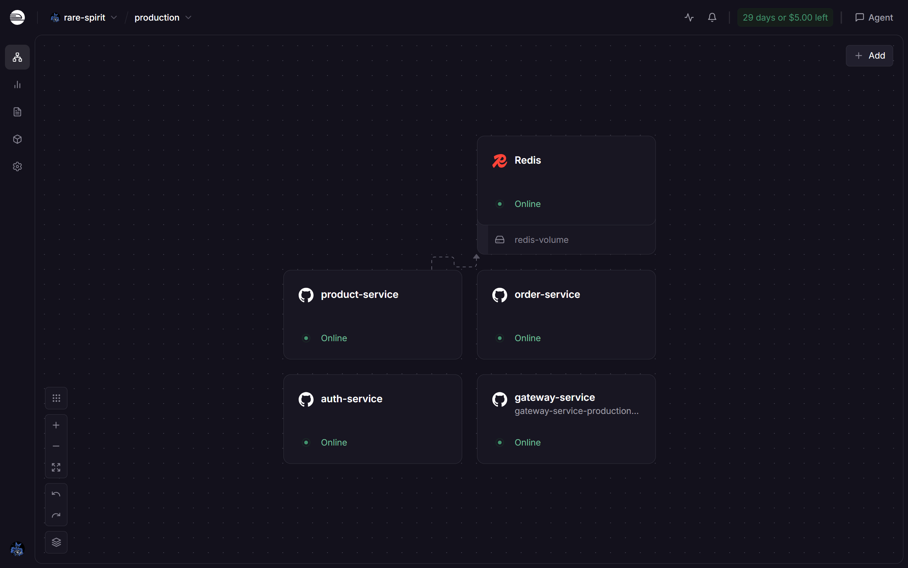
*(Hình 1: Dashboard Railway hiển thị gateway-service, product-service, order-service, auth-service và Redis)*

---

### 📸 Minh chứng 2: API Gateway Live Health Check
*API Gateway hoạt động trên tên miền công khai và điều phối các dịch vụ.*

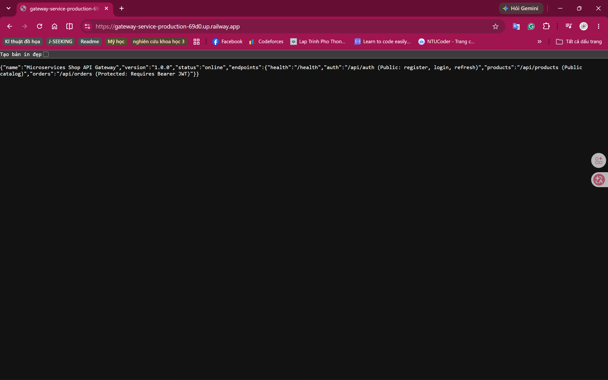
*(Hình 2: Trình duyệt truy cập `https://gateway-service-production-69d0.up.railway.app/health` trả về status ok)*

---

### 📸 Minh chứng 3: Yêu cầu nâng cao 1 — Auth Service (Đăng ký, Đăng nhập & JWT)
*Cấp phát accessToken (15 phút) và refreshToken (7 ngày) lưu an toàn.*

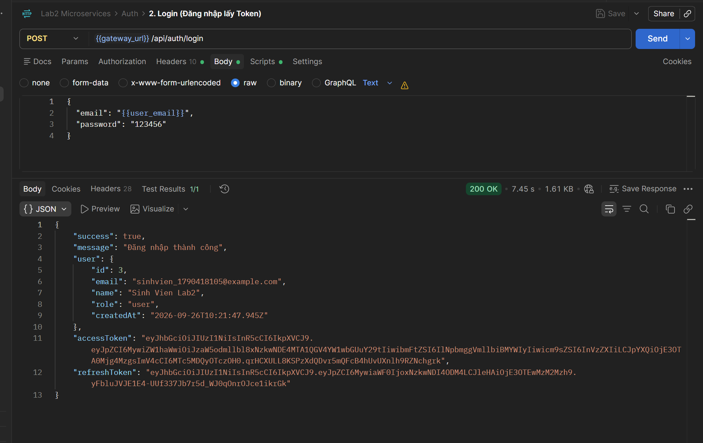
*(Hình 3: Postman gọi POST /api/auth/register và POST /api/auth/login trả về HTTP 201/200 kèm accessToken)*

---

### 📸 Minh chứng 4: Yêu cầu nâng cao 2 — Gateway JWT Auth Guard
*Gateway chặn 401 Unauthorized khi truy cập /api/orders không có Token.*

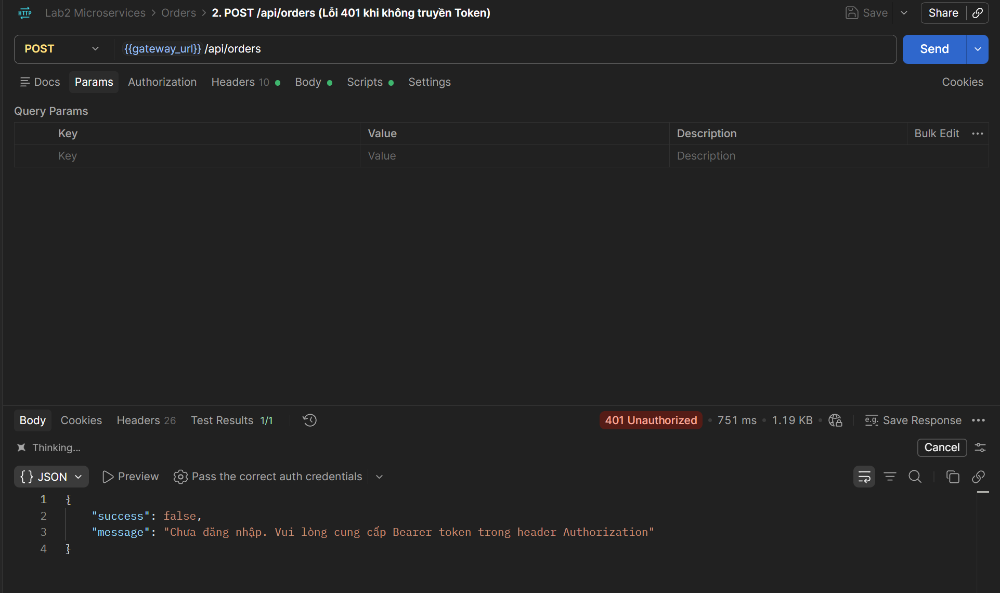
*(Hình 4: Gọi GET /api/orders khi chưa có Bearer Token, Gateway trả về 401 Chưa đăng nhập)*

---

### 📸 Minh chứng 5: Product Service — Phân trang, Tìm kiếm & Lọc
*Kết quả trả về danh sách sản phẩm với cấu trúc pagination.*

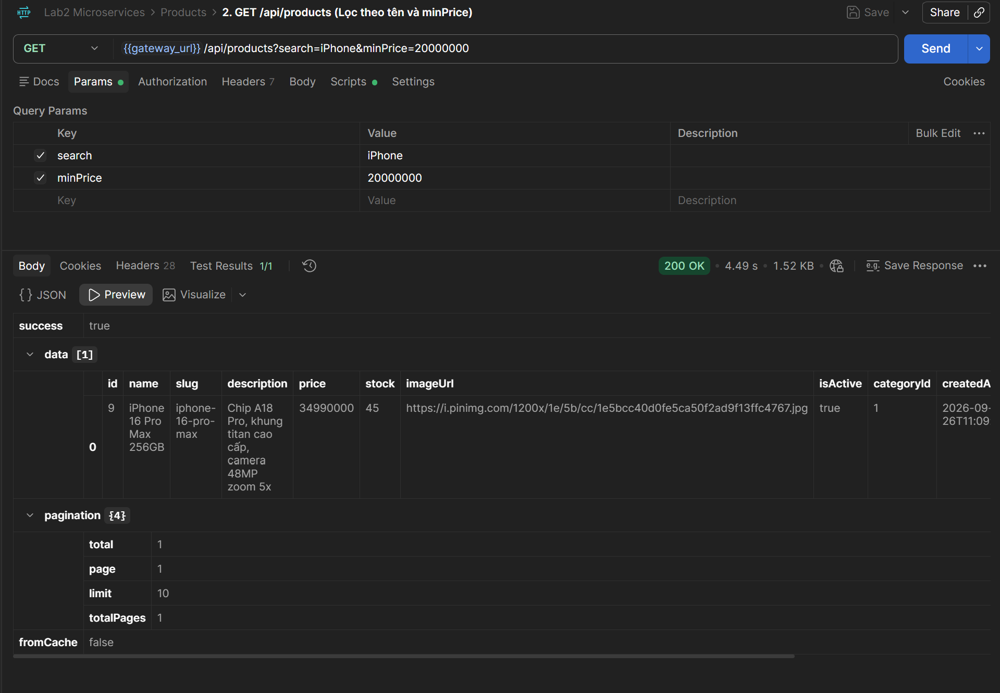
*(Hình 5: GET /api/products?page=1&limit=5 lọc theo tên và minPrice)*

---

### 📸 Minh chứng 6: Yêu cầu nâng cao 4 — Caching dữ liệu với Redis
*Minh chứng tốc độ phản hồi tức thì từ RAM Redis (`fromCache: true`).*

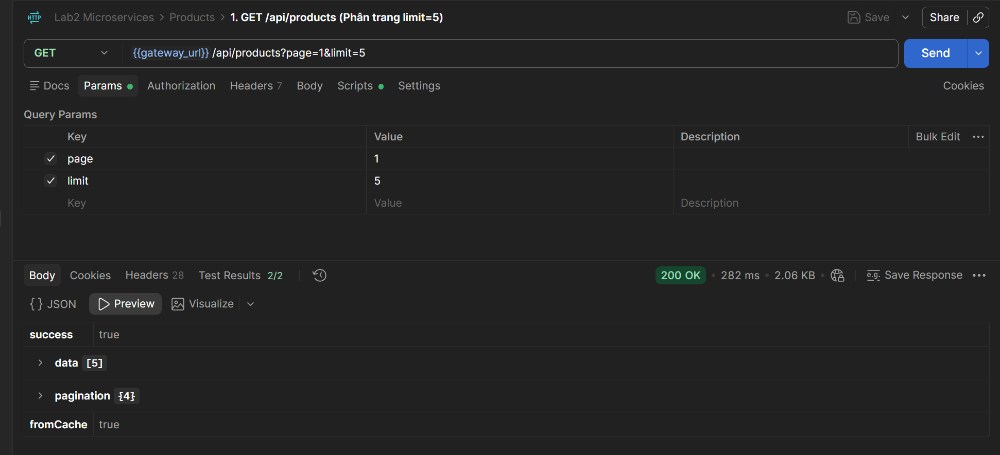
*(Hình 6: So sánh lần gọi 1 "fromCache": false và lần gọi 2 "fromCache": true lấy từ RAM Redis)*

---

### 📸 Minh chứng 7: Yêu cầu nâng cao 3 — Upload ảnh sản phẩm lên Cloudinary
*Ảnh tải lên thành công và trả về URL trực tiếp từ res.cloudinary.com.*

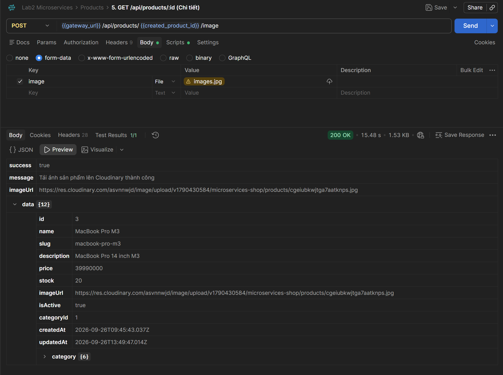
*(Hình 7: Gọi POST /api/products/:id/image kèm file ảnh, trả về HTTP 200 kèm link Cloudinary)*

---

### 📸 Minh chứng 8: Order Service — MongoDB Atlas & Tự sinh orderCode
*Đơn hàng được lưu vào MongoDB với mã `ORD-YYYYMMDD-XXXX` và trường ảo `totalItems`.*

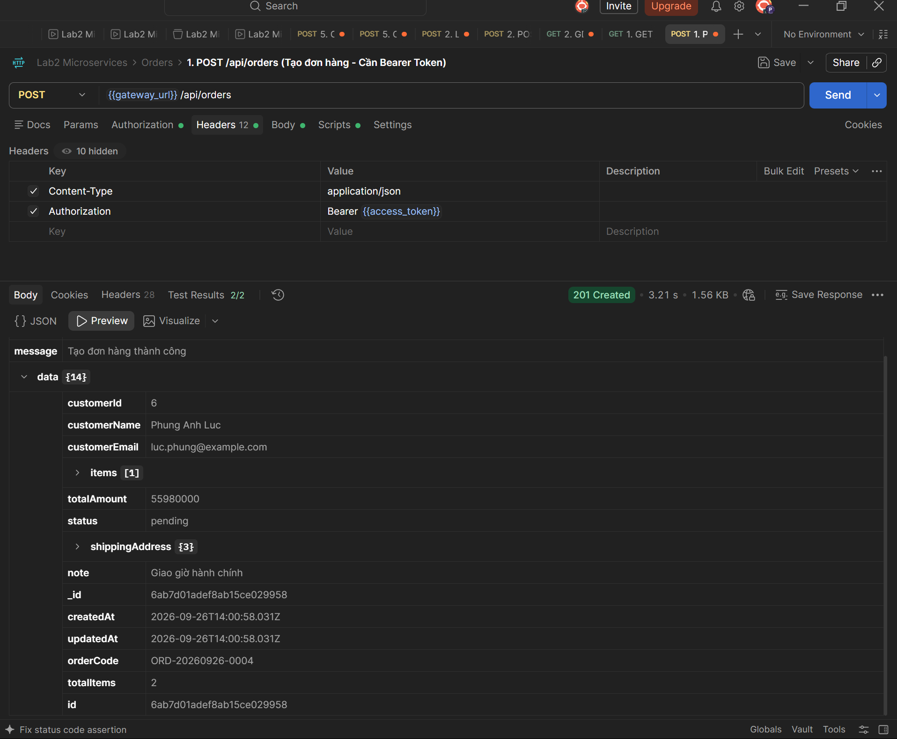
*(Hình 8: POST /api/orders tạo đơn hàng thành công, hiển thị orderCode tự sinh và totalItems)*

---

### 📸 Minh chứng 9: Yêu cầu nâng cao 5 — Swagger UI với Bearer Auth
*Giao diện tài liệu tương tác với nút Authorize Bearer Token.*

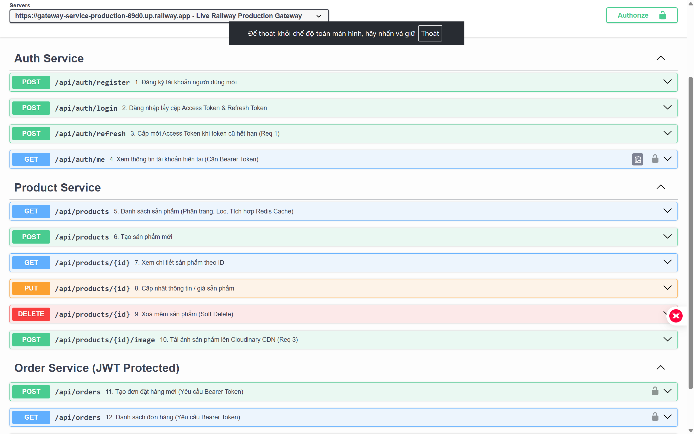
*(Hình 9: Giao diện Swagger UI tại /api-docs hiển thị các endpoint và ô nhập Bearer JWT)*

---

### 📸 Minh chứng 10: Cơ sở dữ liệu Cloud thực tế
*Dữ liệu được lưu trữ trên Supabase (PostgreSQL) và MongoDB Atlas.*

| Supabase PostgreSQL (Table Editor) | MongoDB Atlas (Collection Viewer) |
| :---: | :---: |
| 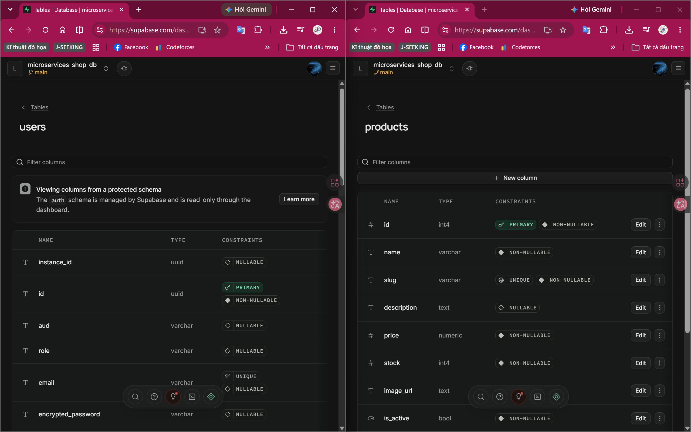 | 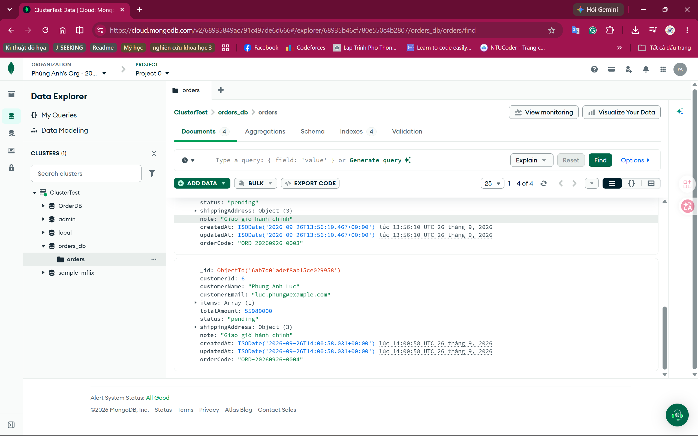 |
| *(Bảng `products` & `users` trên Supabase)* | *(Collection `orders` trên MongoDB Atlas)* |

---

### 📸 Minh chứng 11: Postman Automated Test Suite (Xanh 100%)
*Toàn bộ 18+ kịch bản kiểm thử tự động đều vượt qua (Pass).*

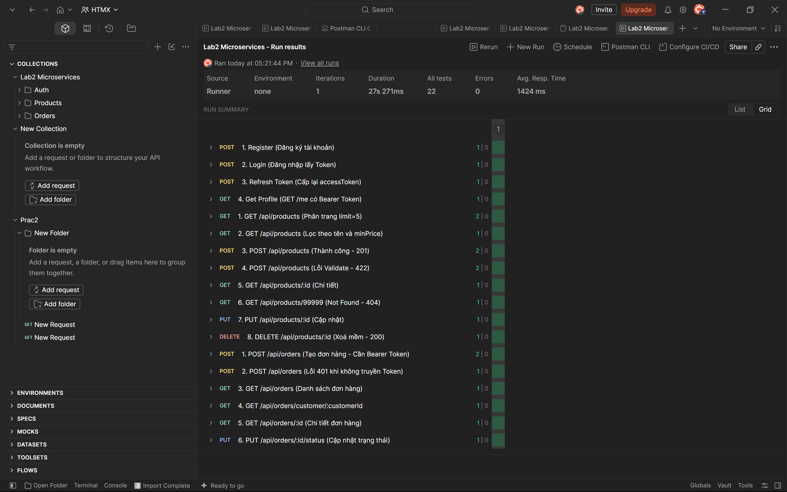
*(Hình 11: Màn hình Postman Collection Runner hoàn thành 100% test cases không có lỗi)*

---

### 📸 Minh chứng 12: Giao diện người dùng Web Storefront (Next.js 15)
*Giao diện thương mại điện tử hiện đại, hiển thị huy hiệu Redis Cache và tích hợp đầy đủ tính năng.*


*(Hình 12: Giao diện web Next.js 15 hiển thị danh mục sản phẩm, nhãn Redis Cache và modal giỏ hàng)*

---

## 4. HƯỚNG DẪN KHỞI CHẠY DỰ ÁN

### 🐳 Khởi chạy môi trường Local bằng Docker Compose
Chỉ cần 1 câu lệnh duy nhất để khởi động toàn bộ 7 containers (4 services + 3 databases/cache):

```bash
# 1. Clone repository
git clone https://github.com/phunganhluc3105-spec/N23DCPT033_PhungAnhLuc_Web_Prac2A.git
cd N23DCPT033_PhungAnhLuc_Web_Prac2A

# 2. Khởi động toàn bộ hệ thống
docker compose up -d --build

# 3. Chạy seed dữ liệu mẫu sản phẩm
docker compose exec product_service node prisma/seed.js
```

### 💻 Khởi chạy giao diện Frontend (Next.js 15)
```bash
cd lab2a-frontend
npm install
npm run dev
# Mở trình duyệt tại http://localhost:3000
```
